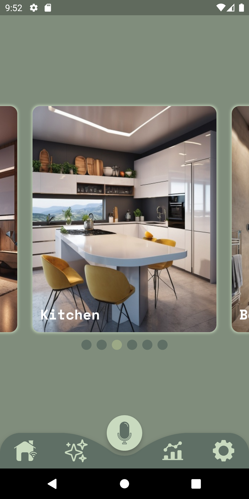
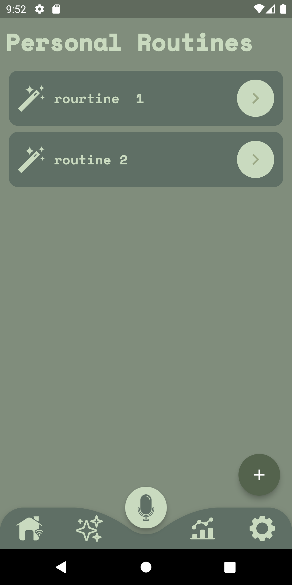
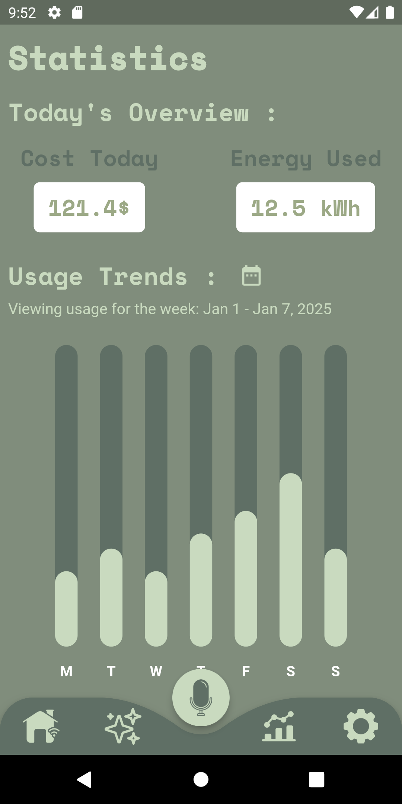
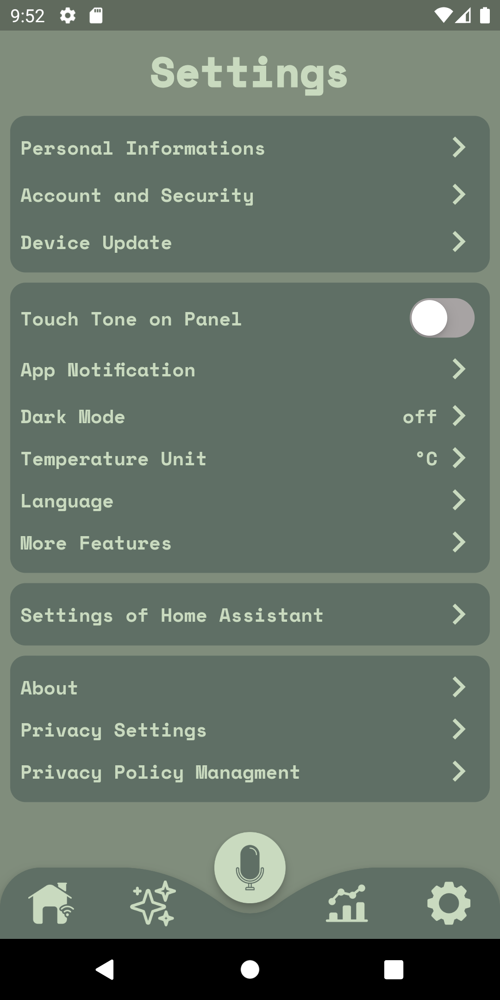

# Home Assistant App

**Home Assistant** is a smart home management application built with a **.NET microservices backend** and a **Flutter frontend**. The app allows users to control and manage their smart devices, set routines, monitor energy consumption, and customize settings seamlessly.

---

## Features

### Backend (.NET Microservices)
- **10 Microservices**: Each microservice handles a specific smart device or functionality (e.g., Smart Clock API, Smart TV API, Smart Thermostat API).
- **Smart Device Management**: 
  - Each device inherits from a base `SmartDevice` class, which includes properties like `DeviceId`, `DevicePassword`, `Name`, `RoomIndex`, and `IsOn`.
  - Example: The `SmartClock` model extends `SmartDevice` with additional properties like `Volume` and `Alarm`.
- **Database**: 
  - **SQL Server** is used for data storage.
  - Each microservice has its own **CRUD operations** for managing devices and data.
- **Scalable Architecture**: Modular design ensures easy maintenance and scalability.

### Frontend (Flutter)
- **4 Screens**:
  1. **Home Screen**:
     - Displays rooms and smart devices in each room.
     - Users can **add**, **edit**, or **delete** smart devices.
  2. **Routines Screen**:
     - Users can create routines triggered by **voice** or **timer**.
     - Define actions to be performed during the routine.
  3. **Statistics Screen**:
     - Displays energy consumption in **kWh** and cost in **$**.
     - Weekly usage trends are visualized for better insights.
  4. **Settings Screen**:
     - Customize app settings like **personal information**, **notifications**, **dark mode**, **temperature unit**, and **language**.
- **Local Storage**: 
  - Data is saved locally on the device using **Sqflite**.

---

## Screenshots and Demo

<div style="display: flex; flex-wrap: wrap;">
  
  
  
  
</div>

### Demo Video
[](Flutter/Demo/Demo.mp4)

---

## Technologies Used

### Backend
- **.NET** (C#) for building microservices.
- **SQL Server** for database management.
- **CRUD Operations** for each microservice.

### Frontend
- **Flutter** (Dart) for cross-platform mobile app development.
- **Sqflite** for local data storage.

---

## Getting Started

### Prerequisites
- **.NET SDK** for backend development.
- **Flutter SDK** for frontend development.
- **SQL Server** for database setup.
- **Sqflite** package for Flutter local storage.

### Installation
1. Clone the repository:
   ```bash
   git clone https://github.com/your-username/home-assistant-app.git
